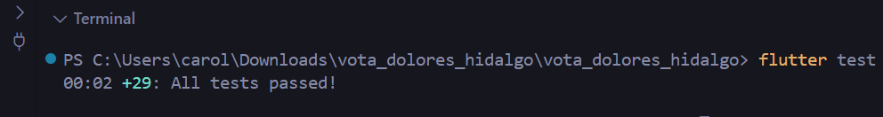
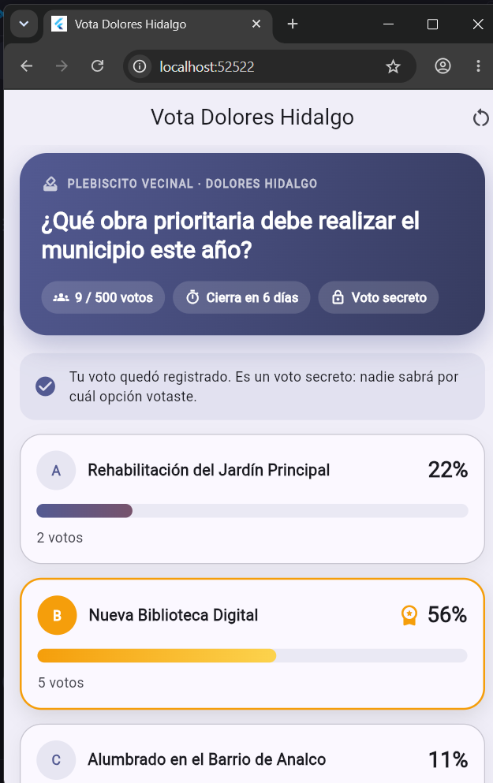
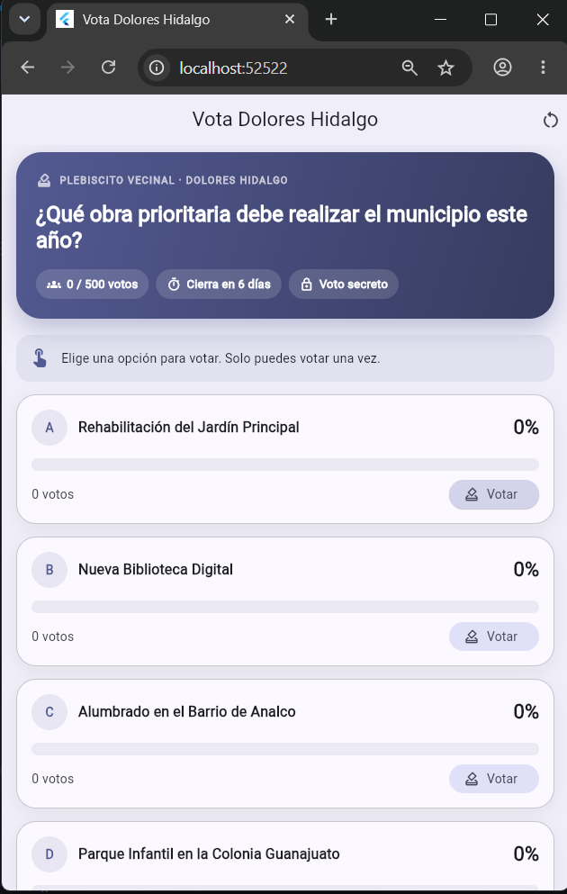
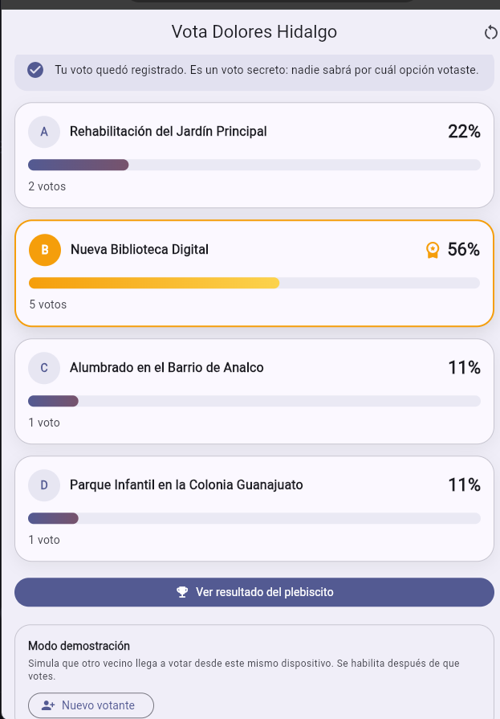
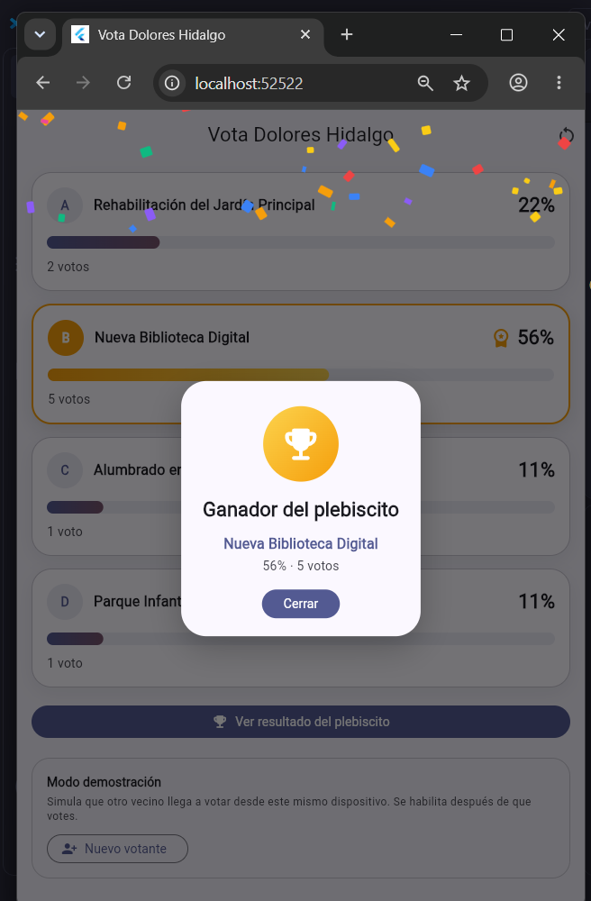
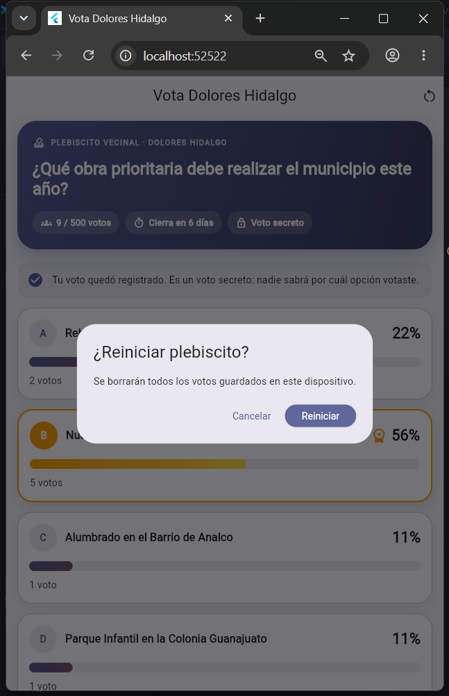

# Vota Dolores Hidalgo

Plebiscito vecinal digital construido con **Flutter** y desarrollado con **TDD**. El municipio plantea una pregunta con varias opciones, los vecinos votan y los resultados se muestran en barras animadas. Al final se revela al ganador con una animación y confeti.

Proyecto complementario de práctica TDD de la materia Desarrollo Móvil Integral.

## Características

- Votación con una pregunta y cuatro opciones reales para Dolores Hidalgo.
- Barras de resultados animadas con porcentajes en tiempo real.
- Revelación del ganador con rebote y confeti dibujado con `CustomPainter`.
- Voto secreto: solo se guarda que el vecino ya votó, no por cuál opción.
- Límite de 500 votantes y fecha de cierre.
- Los votos se conservan al cerrar la app (`shared_preferences`).
- Modo demostración para simular varios vecinos desde el mismo dispositivo.

## Reglas de negocio

Cada regla está protegida por pruebas automáticas.

| Regla | Resultado cuando se incumple |
|---|---|
| Cada persona vota una sola vez | `ResultadoVoto.usuarioYaVoto` |
| Solo se puede votar por una opción que exista | `ResultadoVoto.opcionInvalida` |
| No se puede votar después de la fecha de cierre | `ResultadoVoto.votacionCerrada` |
| No se puede superar el límite de votantes | `ResultadoVoto.limiteAlcanzado` |
| Los porcentajes son correctos, incluso sin votos | Todos en 0, sin dividir entre cero |
| Un empate en primer lugar se reconoce como empate | `determinarGanador()` regresa todas las opciones empatadas |

## Estructura del proyecto

```
lib/
  modelos/          Datos: OpcionVotacion, Votacion, ResultadoOpcion
  logica/           Reglas de negocio en Dart puro: ServicioVotacion, ResultadoVoto
  datos/            Persistencia: RepositorioVotacion
  presentation/     Interfaz: VotacionScreen y widgets (barras, encabezado, confeti, diálogo)
  main.dart
test/
  servicio_votacion_test.dart
  repositorio_votacion_test.dart
```

La carpeta `logica/` no depende de Flutter: la interfaz solo le pide resultados y nunca duplica una regla.

## Cómo ejecutar

```bash
flutter pub get
flutter test
flutter run
```

## Pruebas

El proyecto tiene 29 pruebas: 21 de la lógica de votación (rondas 1 a 8, integración y retos) y 8 de persistencia.

<p align="center">
  
</p>

## Capturas de pantalla

<table>
  <tr>
    <th align="center" width="33%">Primer vistazo</th>
    <th align="center" width="33%">Votación (1)</th>
    <th align="center" width="33%">Votación (2)</th>
  </tr>
  <tr>
    <td align="center"></td>
    <td align="center"></td>
    <td align="center"></td>
  </tr>
  <tr>
    <th align="center">Resultado</th>
    <th align="center">Reiniciar</th>
    <th></th>
  </tr>
  <tr>
    <td align="center"></td>
    <td align="center"></td>
    <td></td>
  </tr>
</table>

## Tecnologías

- Flutter y Dart
- `flutter_test` para las pruebas
- `shared_preferences` para la persistencia
